

**INTRODUCCIÓN GITHUB**

Alumno: Iván Guijarro Verbo

Curso: 2º Desarrollo de Aplicaciones Web

Asignatura: Despliegue de aplicaciones web

**Índice**

[Introducción	3](#__refheading___toc151_2542248748)

[Diferentes acciones en GitHub	4](#__refheading___toc153_2542248748)

[Crear una cuenta y un repositorio	4](#__refheading___toc2_89485439)

[Crear una cuenta en GitHub	4](#__refheading___toc4_89485439)

[Crear un nuevo repositorio	4](#__refheading___toc6_89485439)

[Subir archivos a tu repositorio	5](#__refheading___toc8_89485439)

[Subir archivos	6](#__refheading___toc10_89485439)

[Subir el archivo de nuestro ordenador	6](#__refheading___toc12_89485439)

[Ver archivos y commits	7](#__refheading___toc14_89485439)

[Ver historial de commits	7](#__refheading___toc16_89485439)

[Crear y administrar ramas	8](#__refheading___toc18_89485439)

[Fusionar ramas	9](#__refheading___toc155_2542248748)

[Gestionar configuración y permisos	10](#__refheading___toc157_2542248748)

[Conclusiones	10](#__refheading___toc159_2542248748)

# **Introducción**
Este trabajo presenta una guía básica y visual sobre el uso de GitHub. En él se explica paso a paso cómo realizar las acciones fundamentales: crear una cuenta y un repositorio, subir archivos y consultar el historial de commits. Además, se detalla el flujo de trabajo mediante la creación y fusión de ramas (pull requests), así como la gestión de permisos para el trabajo colaborativo.
# **Diferentes acciones en GitHub**
## **Crear una cuenta y un repositorio**
### **Crear una cuenta en GitHub**
Para poder crear una cuenta en GitHub, lo que haremos será entrar en la página oficial de GitHub (<https://github.com/>).

Una vez dentro, nos saldrá esta ventana en la cual pondremos nuestras credenciales si tenemos una cuenta. Si no tenemos una cuenta, iremos al apartado de crear la cuenta y crearemos nuestra cuenta.

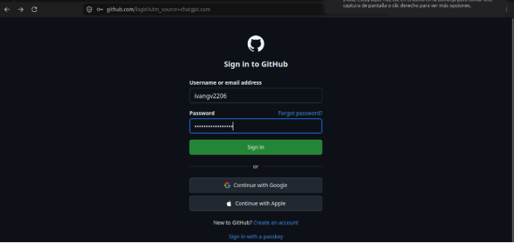
### **Crear un nuevo repositorio**
Para poder creare un repositorio, iremos al apartado de “Create repository”. Si no es así, haremos clic en New y buscaremos la opción de Repositories.

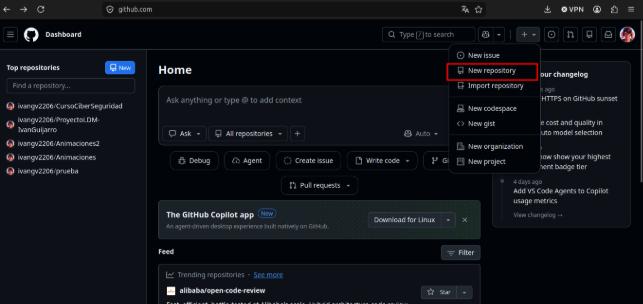

Una vez dentro, nos saldrá este formulario el cual rellenaremos con los siguientes datos:

- Nombre repositorio → pruebaGitHub.
- Descripción.
- Visibilidad del repositorio → en nuestro caso será público.
- Marcaremos la opción de inicializar el repositorio con README para crear un archivo README inicial.

Después haremos clic en el botón de crear repositorio.

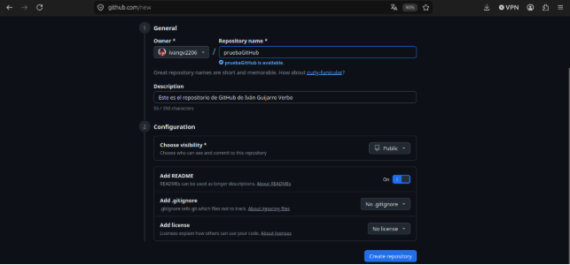
## **Subir archivos a tu repositorio**
Una vez que hemos creado el repositorio, seremos redirigidos a la página principal de nuestro repositorio.

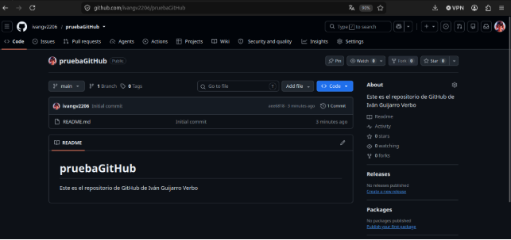
### **Subir archivos**
Una vez que estamos dentro de nuestro repositorio, lo que haremos a continuación será subir un archivo. Para ello haremos clic en el botón de Add file que se encuentra justo encima de la lista de archivos y seleccionaremos Upload files.

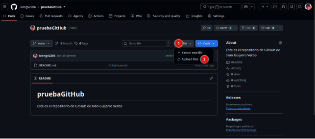
### **Subir el archivo de nuestro ordenador**
Una vez que estamos dentro, veremos esta ventana en la cual arrastraremos un archivo de nuestro ordenador para que esté dentro de nuestro repositorio.

También podemos escribir un mensaje que describa los cambios que estamos haciendo en nuestro repositorio. Nos aseguraremos de dejar seleccionada la opción de Commit directly to the main branch si queremos que los cambios se realicen en la rama principal.

Una vez hecho esto, haremos clic en Commit changes para completar el proceso.

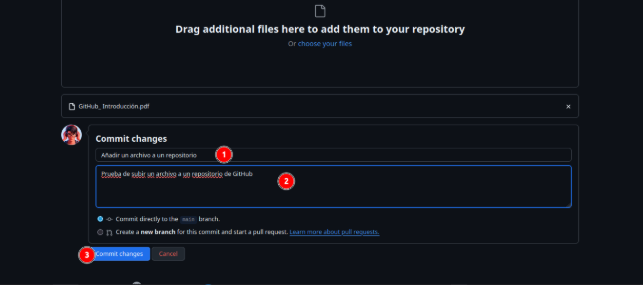
## **Ver archivos y commits**
Después de haber subido el archivo, veremos que el mismo aparece en el repositorio. También podremos hacer clic sobre él para ver su contenido.

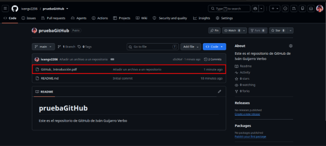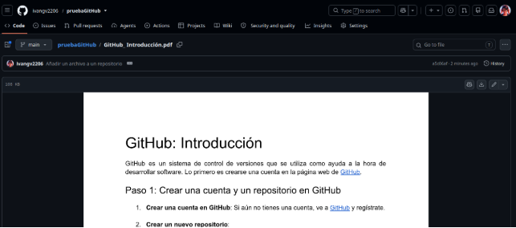
### **Ver historial de commits**
Para poder ver el historial de cambios, haremos clic en la pestaña Commits que está justo encima de la lista de archivos.

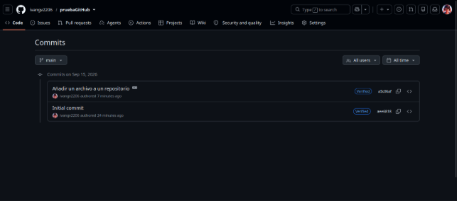

*Como podemos ver, tendremos una lista de todos los commits junto con los mensajes de commit y quién los realizó.*

## **Crear y administrar ramas**
Para poder crear una nueva rama, iremos a la página principal de nuestro repositorio y haremos clic en el menú desplegable main 

Después escribiremos el nombre de la nueva raíz que queremos crear y haremos clic en Create branch. Esto nos llevará automáticamente a la nueva raíz.

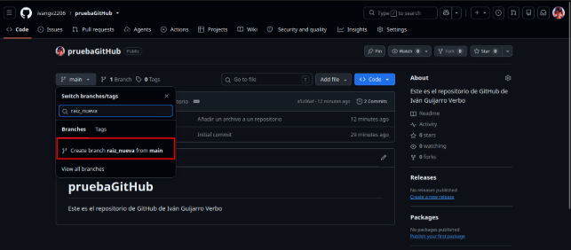

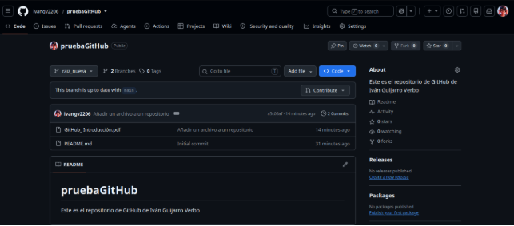

Desde esta rama, podremos agregar o modificar archivos igual que lo hicimos en pasos anteriores. Estos cambios no afectarán a la main hasta que las fusionemos.

### **Fusionar ramas**
Si queremos fusionar los cambios que hacemos en una rama con la rama principal, haremos un pull request. 

Para ello iremos a la pestaña Pull requests en nuestro repositorio y haremos clic en New pull request.

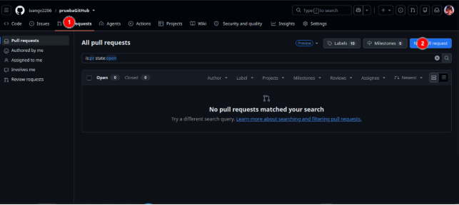

Después de haber revisado, haremos clic en Merge pull request para combinar los cambios de la rama en la rama principal.

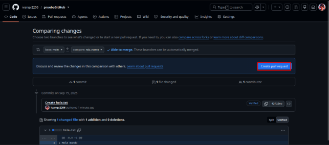
## **Gestionar configuración y permisos**
GitHub nos permite configurar diferentes aspectos del repositorio. Para ello haremos clic en Settings en la parte superior del repositorio para cambiar la configuración. También podremos agregar colaboradores para que otras personas pueda trabajar en nuestro repositorio.

También podremos agregar personas para que trabajen en nuestro repositorio. Estas personas podrá tener acceso para hacer cambios, dependiendo de los permisos que les demos.

# **Conclusiones**
En conclusión, GitHub proporciona un entorno estructurado y accesible para el control de versiones y la gestión de proyectos. Gracias a funciones como las ramas, los commits y los pull requests, permite registrar los cambios de un proyecto de forma segura sin afectar a la versión principal. Las opciones de configuración y colaboración demuestran que es una plataforma esencial y muy completa para trabajar tanto de manera individual como en equipo.
