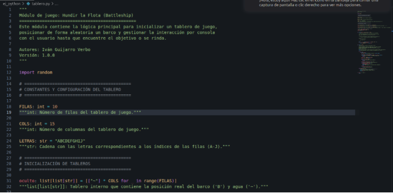
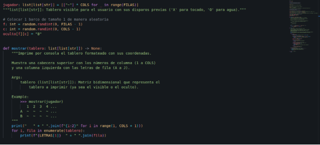
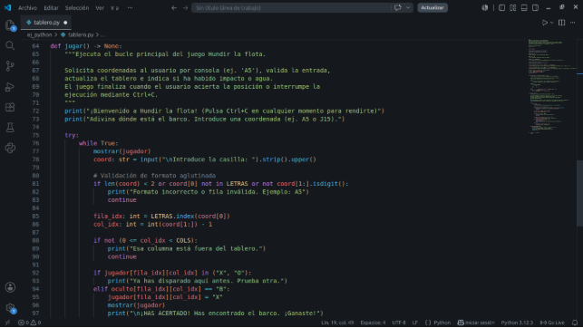
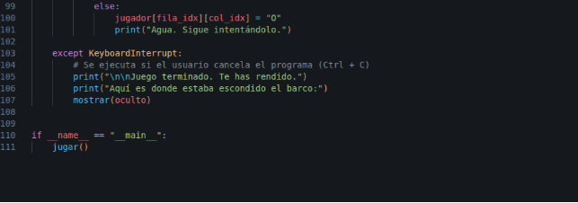



**EVALUACIÓN Y USO DE UN GENERADOR DE DOCUMENTACIÓN**

Alumno: Iván Guijarro Verbo

Curso: 2ºDAW

Asignatura: Despliegue de aplicaciones web

***Índice***

[*Ficha comparativa de herramientas de documentación	3*](#__refheading___toc2_969887519)

[*Documentación código	3*](#__refheading___toc7_969887519)

[*Reflexión	5*](#__refheading___toc4_969887519)
\*\

# **Ficha comparativa de herramientas de documentación**
A continuación se comparan en una tabla tres herramientas muy utilizadas en entornos web: JSDoc (ideal para lógica y backend JS), MkDocs (ideal para manuales y wikis de proyecto) y Swagger (estándar para APIs REST)

|Herramienta|Facilidad de uso|Integración con proyectos|Formatos de salida|Comunidad y soporte |Curva de aprendizaje|
| :-: | :-: | :-: | :-: | :-: | :-: |
|JSDoc|Alta|Excelente en Node.js/JS. Se integra fácilmente en scripts de npm o pipelines CI/CD.|HTML (nativo), Markdown y JSON (mediante plugins).|Enorme. Es el estándar de facto para documentar JavaScript.|Baja. Solo requiere aprender las etiquetas básicas (@param, @return).|
|MkDocs|Muy alta|Se integra a nivel de repositorio. Ideal para publicar en GitHub Pages o GitLab Pages.|HTML (sitio web estático). PDF (mediante plugins de exportación).|Muy grande. Extensible mediante temas (ej. Material for MkDocs).|Muy baja. Si sabes Markdown, sabes usar MkDocs.|
|Swagger (OpenAPI)|Media|Fundamental para APIs REST. Se integra en frameworks como Express, Spring Boot o FastAPI.|HTML (UI interactiva donde probar la API), JSON, YAML.|Gigante. Estándar de la industria para documentar servicios web.|Media. La sintaxis OpenAPI es detallada y requiere entender conceptos HTTP.|

# **Documentación código**
En este apartado realizaré la documentación de un código para después generar esa respectiva documentación en distintos formatos

El código que he documentado es el siguiente:

\*\

# 
A continuación se ha utilizado la herramienta correspondiente para poder generar dicha documentación en distintos formatos los cuales están dentro de una carpeta de nuestro [PORTFOLIO junto con el código documentado](<https://github.com/ivangv2206/Portfolio-Ivan-Guijarro/tree/main/UT1%3AGithub%20y%20Markdown/ejercicios/documentacion>)
# **Reflexión**
La aplicación de estándares de documentación mediante Docstrings (PEP 257) en el proyecto del juego Hundir la Flota ha permitido transformar un script sencillo en un código profesional, mantenible y autocontenido.

**Facilidad de uso:** Integrar los comentarios directamente en las funciones y constantes del script en Python resultó muy intuitivo. El uso de anotaciones de tipo (type hints) junto con descripciones claras de parámetros (Args) y valores de retorno (Returns) facilitó que herramientas como pdoc extraigan la estructura automáticamente sin necesidad de redactar manuales externos.

**Ventajas y Desventajas:**

- **Ventajas:** La principal ventaja es que el código fuente se convierte en la única fuente de verdad. Generar formatos en HTML y Markdown se realiza mediante un único comando en la terminal, asegurando que cualquier cambio en la lógica del juego se refleje de inmediato en la documentación web.
- **Desventajas:** La inclusión de docstrings detallados duplica la extensión en líneas del archivo de código, lo que requiere un hábito de lectura más estructurado al editar.

**Recomendación para proyectos colaborativos:** Recomiendo totalmente esta práctica para cualquier proyecto en equipo. Al trabajar de manera colaborativa, los miembros del equipo pueden consultar las firmas de las funciones y los ejemplos de uso en el sitio web generado en HTML sin necesidad de revisar la implementación interna del código, agilizando el desarrollo y reduciendo errores de integración.

