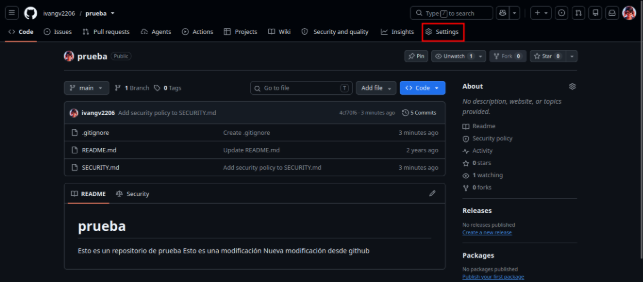
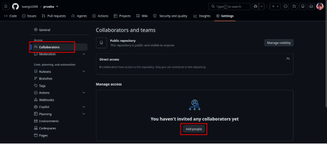


[Enlace al archivo .gitignore](https://github.com/ivangv2206/prueba/blob/main/.gitignore)
[Enlace al archivo SECURITY.md](https://github.com/ivangv2206/prueba/blob/main/SECURITY.md)

**PRUEBAS DE ACCESIBILIDAD Y ROLES**

Alumno: Iván Guijarro Verbo

Curso: 2ºDAW

Asignatura: Despliegue de aplicaciones web

Para poder acceder a los distintos roles de GitHub, iremos a la página principal de nuestro repositorio y haremos clic en la pestaña de Settings.

Una vez que estemos dentro, haremos clic en la opción Collaborators que sale en el menú lateral izquierdo.

Una vez dentro, veremos un botón en el que pone Add people el cual pulsaremos para poder añadir gente a nuestro repositorio para que colabore en él.

Si hacemos clic en el botón, podremos invitar a alguien para que pueda participar en nuestro repositorio y atribuirle distintos roles a dicha persona. Estos roles son los siguientes:

- **Permiso de lectura (Read):** Permite clonar el repositorio, leer el código, abrir *Issues* y debatir, pero no permite subir (*push*) ningún cambio.
  - *Rol adecuado:* Ideal para perfiles de QA (testers), gestores de proyecto no técnicos, o miembros de otros departamentos que solo necesitan auditar el código o leer la documentación.
- **Permiso de escritura (Write):** Permite hacer *push* a las ramas (salvo que estén protegidas) y gestionar *Pull Requests* e *Issues*.
  - *Rol adecuado:* Es el permiso estándar para los **Desarrolladores** del equipo. Les da la libertad necesaria para trabajar sin darles el poder de destruir el proyecto.
- **Permiso de administrador (Admin):** Tiene control total. Puede añadir o eliminar colaboradores, cambiar la visibilidad del repositorio, borrarlo por completo o cambiar las reglas de las ramas protegidas.
  - *Rol adecuado:* Debe restringirse únicamente al **Líder Técnico (Tech Lead)**, al **DevOps** o al creador original del proyecto.

